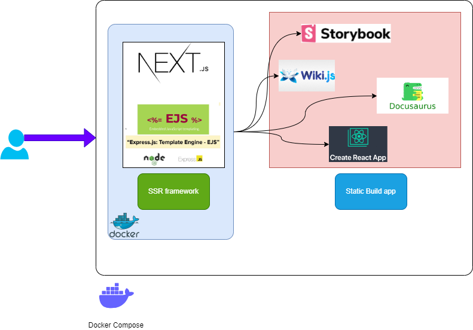

# Description
This project is inspired by [authelia](https://www.authelia.com/) self hosted server app, the main difference:
- DX more technical and developper oriented
- Customized front-end and back-end (DB) layer from a full Stack SSR framework
- Easy to deploy with Docker compose 
- An alternative to Nginx, (or the layer before the Nginx configuration)

Authetication layer, landing page, redirection form before dispatching to main static build of

- create react app
- StoryBook
- webpack js bundler 

